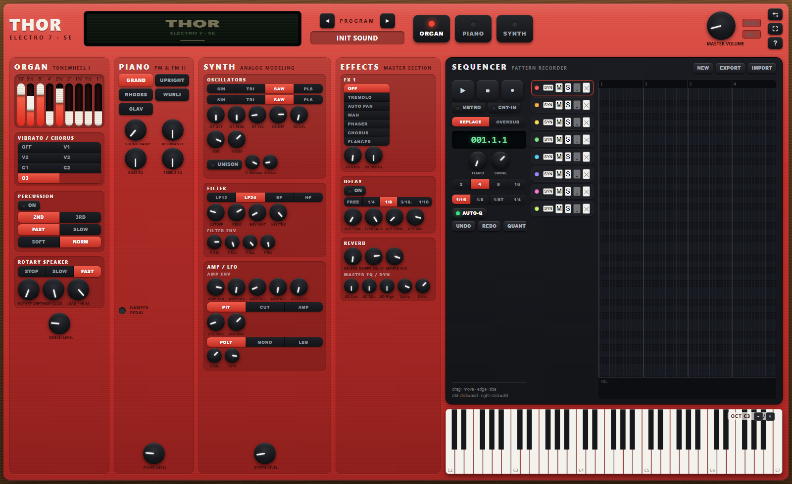
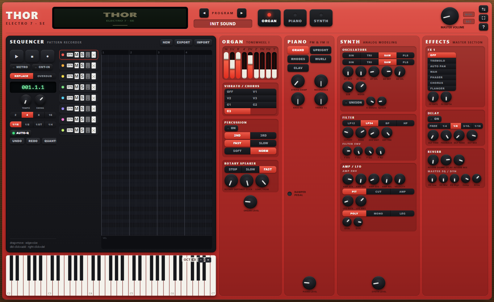

# THOR ELECTRO 7

A standalone, browser-based **performance synthesizer** inspired by classic red stage keyboards. It bundles three sound engines — a **drawbar/tonewheel organ**, an **acoustic & electric piano**, and an **analog-modeling synth** — with a full **master effects** section and a built-in **pattern sequencer + piano-roll editor**.

Plug in a MIDI keyboard and play, or use the on-screen keyboard / your computer keys. It's written in **pure vanilla JavaScript** on top of the **Web Audio** and **Web MIDI** APIs — no frameworks, no dependencies, no build step, no server. Every sound is synthesized live in the browser; there are no samples.

### ▶ Live: https://thor-electro-7.pages.dev



The whole instrument scales to fill the screen. The **sequencer + keyboard** live in a side pane you can flip to the left or right with the ⇄ button:



---

## Contents

- [Quick start](#quick-start)
- [Playing it](#playing-it)
- [The interface, control by control](#the-interface-control-by-control)
  - [Top bar](#top-bar)
  - [Organ](#organ)
  - [Piano](#piano)
  - [Synth](#synth)
  - [Effects](#effects)
  - [Sequencer & piano roll](#sequencer--piano-roll)
  - [On-screen keyboard](#on-screen-keyboard)
- [Keyboard shortcuts](#keyboard-shortcuts)
- [How the code is organized](#how-the-code-is-organized)
- [Running & deploying](#running--deploying)
- [Support](#support)
- [License](#license)

---

## Quick start

Because browsers gate audio and some APIs behind a user gesture and a secure context, **serve the folder over HTTP** rather than opening the file directly:

```bash
python -m http.server 8000
# then open http://localhost:8000
```

Click **power on** (this is the gesture that starts the audio engine and requests MIDI access). That's it — start playing.

> **Tip:** MIDI is most reliable on the hosted HTTPS version (a "secure context"). Some browsers restrict Web MIDI on `file://` pages.

---

## Playing it

You can drive the instrument three ways, all at once if you like:

- **MIDI keyboard** — connect over USB and allow MIDI access when prompted. Note on/off, **velocity**, **pitch bend**, the **mod wheel** (CC1), and the **sustain pedal** (CC64) are all supported. "All notes off" (CC120/123) triggers a panic.
- **Computer keyboard** — the lower row `Z S X D C V G B H N J M , . /` plays a chromatic octave; the upper row `Q 2 W 3 E R …` plays the octave above. `-` / `=` shift the playable octave down/up. Hold **Shift** for softer (lower-velocity) notes.
- **On-screen keyboard** — click and drag across the keys at the bottom of the screen.

Whatever is enabled in the top bar (Organ / Piano / Synth) sounds simultaneously, so you can **layer** all three engines on one keypress.

Press **Esc** at any time to **panic** (silence all notes).

---

## The interface, control by control

Every knob supports **drag** (up/down), **mouse wheel**, **double-click to reset to default**, and **Shift-drag / Shift-wheel for fine adjustment**. The value and parameter name appear on the OLED as you turn it.

### Top bar

| Control | What it does |
|---|---|
| **OLED display** | Shows the boot logo, then the live status: program number & name, which engines are active, organ Leslie/vibrato state, tempo, transport position, and a right-hand **VU meter**. Turning any control flashes its name and value here. |
| **◀ PROGRAM ▶** | Steps through the 17 built-in factory programs (gospel/jazz/rock organs, grand/upright/Rhodes/Wurlitzer/clav pianos, and a set of synth patches). |
| **ORGAN / PIANO / SYNTH** | Enable/disable each engine. Lit engines all sound together (layering). |
| **MASTER VOLUME** | Overall output level. |
| **MIDI / REC LEDs** | MIDI flickers on incoming activity; REC lights while the sequencer is recording. |
| **⇄** | Swap the control columns and the sequencer/keyboard pane between left and right. |
| **⛶** | Toggle browser full-screen. |
| **?** | Open the quick-reference / shortcuts panel. |

### Organ

A modeled **tonewheel organ** — each note is built from nine sine "drawbars" (additive synthesis) and run through a scanner vibrato and a rotating-speaker simulation.

| Control | What it does |
|---|---|
| **Drawbars** (`16′ 5⅓′ 8′ 4′ 2⅔′ 2′ 1⅗′ 1⅓′ 1′`) | Nine sliders, each mixing in a harmonic at a given "footage" (pitch). Drag or scroll a slider 0–8. This is the heart of the organ's tone. |
| **Vibrato / Chorus** | Scanner modulation: **V1/V2/V3** are vibrato depths; **C1/C2/C3** are the richer chorus variants; **OFF** bypasses it. |
| **Percussion → ON** | Adds the classic keyed percussion click-tone on attack. |
| **2ND / 3RD** | Percussion harmonic (second or third). |
| **FAST / SLOW** | Percussion decay speed. |
| **SOFT / NORM** | Percussion level. |
| **Rotary Speaker → STOP / SLOW / FAST** | Leslie speed. Ramps between speeds like a real cabinet spinning up/down. |
| **Rotary Depth** | Amount of Doppler/amplitude swirl. |
| **Key Click** | Level of the attack/release key click transient. |
| **Leak / Hum** | Tonewheel leakage and mains hum for vintage grit. |
| **Organ Level** | Engine output level. |

### Piano

Five instruments in one engine. **Grand** and **Upright** are physically-modeled strings (Karplus-Strong) with hammer noise and a soundboard; **Rhodes** and **Wurlitzer** are FM electric pianos with tine/bark character and tremolo; **Clav** is a plucked, filtered clavinet.

| Control | What it does |
|---|---|
| **GRAND / UPRIGHT / RHODES / WURLI / CLAV** | Selects the instrument. The two macro knobs below **re-label themselves** per instrument. |
| **X1** (contextual) | *Grand/Upright:* **String Damp** · *Rhodes:* **Bell** (tine level) · *Wurli:* **Bark** (overdrive) · *Clav:* **Tone**. |
| **X2** (contextual) | *Grand/Upright:* **Resonance** · *Rhodes:* **Body** · *Wurli:* **Trem** (tremolo depth) · *Clav:* **Snap** (pickup attack). |
| **Bass EQ / Treble EQ** | Shelf tone controls. |
| **Damper Pedal LED** | Lights when the sustain pedal is held. |
| **Piano Level** | Engine output level. |

### Synth

A two-oscillator **analog-modeling** synth with a sub oscillator, noise, a unison stack, a multimode filter, two envelopes, an LFO, and mono/poly voicing.

| Section | Controls |
|---|---|
| **Oscillators** | Two oscillators, each **SIN / TRI / SAW / PLS** (pulse). **O1 OCT** (±2 octaves) and **O1 SEMI** (±12) tune osc 1; **O1 LVL / O2 LVL** set levels; **O2 DET** detunes osc 2 in cents for fatness. **SUB** adds an octave-down square; **NOISE** blends in filtered noise. |
| **Unison** | **UNISON** stacks 5 detuned voices per note; **U-Detune** spreads their tuning, **Spread** their stereo position. |
| **Filter** | Type **LP12 / LP24 / BP / HP**. **Cutoff**, **Reso** (resonance), **Env Amt** (how far the filter envelope sweeps cutoff, bipolar), **Key Trk** (cutoff tracks note pitch). |
| **Filter Env** | Dedicated **A / D / S / R** envelope driving the filter. |
| **Amp / LFO** | **Amp Env** A/D/S/R shapes loudness; **Velocity** sets how much key velocity affects level. **LFO** destination **PIT / CUT / AMP** with **Rate** and **Amt**. |
| **Voice mode** | **POLY / MONO / LEG** (legato). **Glide** (portamento time, mono/legato) and **Drift** (subtle analog tuning instability). |
| **Synth Level** | Engine output level. |

### Effects

A shared master chain applied to all three engines.

| Section | Controls |
|---|---|
| **FX 1** | One modulation slot: **Tremolo / Auto-Pan / Wah / Phaser / Chorus / Flanger**, with **Rate** and **Depth**. |
| **Delay** | **ON**, plus a tempo-synced division (**Free / 1/4 / 1/8 / 3/16 / 1/16**). **Time** (used in Free mode), **Feedback**, **Tone** (feedback-path damping) and **Mix**. It's a stereo ping-pong delay. |
| **Reverb** | Convolution reverb with **Decay**, **Pre-delay** and **Mix** (the impulse is generated procedurally from the decay setting). |
| **Master EQ / Dyn** | Three-band EQ (**Low / Mid / High**), a **Comp** (compressor) amount, and **Drive** (tube-style saturation). A brick-wall limiter sits at the very end to keep the output clean. |

### Sequencer & piano roll

An **8-track** pattern sequencer with a lookahead-scheduled transport (tight timing), per-track recording, and a full piano-roll editor.

**Transport & song controls**

| Control | What it does |
|---|---|
| **▶ ■ ●** | Play/pause, stop, and record-arm. |
| **METRO / CNT-IN** | Metronome click, and a one-bar count-in before recording. |
| **REPLACE / OVERDUB** | Recording mode: overwrite the armed track, or layer new notes on top. |
| **Position readout** | Bar.Beat.Sixteenth. |
| **Tempo / Swing** | Song BPM and swing amount (also re-syncs tempo-locked delay). |
| **Bars (2/4/8/16)** | Loop length. |
| **Grid (1/16, 1/8, 1/8T, 1/4)** | Snap resolution for drawing and quantizing. |
| **Auto-Q** | Quantize notes automatically as you record them. |
| **UNDO / REDO / QUANTIZE / DELETE** | Editing commands (also on the keyboard). |
| **NEW / EXPORT / IMPORT** | Start a fresh pattern, or save/load the whole song as a `.json` file. |

**Track strips** — each of the 8 tracks has: a color dot, a name (double-click to rename), an **engine selector** (SYN/PNO/ORG — which engine the track plays), **M**ute, **S**olo, **↓ capture** (snapshot the current full program into the track, so each track can have its own sound — Shift-click the strip to reload it), and **✕ clear**. Click a strip to arm it for editing/recording.

**Piano roll**

| Action | Result |
|---|---|
| Drag on empty grid | Draw a note (drag right to set length). |
| Double-click empty grid | Add a note at the grid size. |
| Drag a note | Move it (pitch + time). |
| Drag a note's right edge | Resize (length). |
| Right-click / double-click a note | Delete it (right-drag erases across notes). |
| Shift-drag | Marquee-select; Shift-click toggles a note in the selection. |
| Velocity lane (bottom strip) | Drag to set the velocity of notes under the cursor / selection. |
| Mouse wheel | Scroll pitch; **Ctrl+wheel** zooms the rows. |

Notes from other tracks show as ghosts, and a playhead sweeps during playback.

### On-screen keyboard

A 61-key (C2–C7) keyboard across the bottom. Click/drag to play; keys light up for every note played from **any** source (MIDI, computer keys, or the sequencer). The **OCT** indicator (top-right of the keys) shows the current computer-keyboard octave; `-` / `=` shift it.

---

## Keyboard shortcuts

| Key | Action |
|---|---|
| `Space` | Sequencer play / pause |
| `Shift+Space` | Stop |
| `Enter` | Toggle record-arm |
| `Z S X D C V …` | Play notes (lower row) |
| `Q 2 W 3 E R …` | Play notes (upper row, +1 octave) |
| `-` / `=` | Octave down / up |
| `Ctrl+Z` / `Ctrl+Y` | Undo / redo |
| `Ctrl+A` | Select all notes |
| `Ctrl+D` | Duplicate selection |
| `L` | Quantize selection |
| `Delete` / `Backspace` | Delete selected notes |
| `Alt+↑ / ↓` | Transpose selection by a semitone |
| `Alt+← / →` | Nudge selection by one grid step |
| `Esc` | Panic (all notes off) |
| `?` | Toggle the help panel |

---

## How the code is organized

Plain scripts loaded in order — no bundler. `window.THOR` is the shared namespace; a tiny pub/sub (`T.on` / `T.emit`) links the modules. The audio graph is built once on power-on and parameters are updated in place.

| File | Responsibility |
|---|---|
| `js/core.js` | Namespace, state, the default program & all parameters, `localStorage` persistence, path/format helpers, the global error surface. |
| `js/display.js` | The OLED canvas — boot animation, the transient "parameter" readout, and the idle status screen with VU meter. Also owns the shared `requestAnimationFrame` loop. |
| `js/effects.js` | The master effects chain: FX1 modulations, ping-pong delay, convolution reverb, 3-band EQ, drive/saturation, compressor and limiter. |
| `js/organ.js` | The tonewheel organ: additive drawbar voices, scanner vibrato/chorus, the rotating-speaker (Leslie) model, key click, percussion, and leakage/hum. |
| `js/piano.js` | The piano engine: Karplus-Strong acoustic strings, 2-op FM Rhodes/Wurlitzer, and the plucked clavinet, plus a soundboard/EQ chain. |
| `js/synth.js` | The analog-modeling synth: oscillators, sub/noise, unison, multimode filter, dual ADSRs, LFO, glide, drift, and voice allocation. |
| `js/voices.js` | The voice manager — routes each note to the enabled engines, and handles layering, sustain, pitch bend and panic. |
| `js/presets.js` | The 17-program factory bank. |
| `js/sequencer.js` | The transport: lookahead scheduling, per-track record with replace/overdub, quantize, swing, metronome, count-in, and song import/export. |
| `js/pianoroll.js` | The piano-roll editor — drawing, moving, resizing, erasing, marquee select, the velocity lane, zoom/scroll, ghost tracks and the playhead. |
| `js/midi.js` | Web MIDI input, the computer-keyboard mapping, and the on-screen keyboard (rendering + hit-testing + note routing). |
| `js/ui.js` | Binds the DOM: builds the knobs, drawbars, toggles, segmented selectors, program bank, transport and track strips, and keeps them in sync with state. |
| `js/main.js` | Boot sequence, power-on, the animation loop, and the layout controls (swap sides / full-screen / help). |
| `css/thor.css` | The full-screen app-shell layout and the red hardware-panel skin. |

---

## Running & deploying

It's static files, so it runs on any web server or static host.

**Local:**
```bash
python -m http.server 8000
```

**Cloudflare Pages** (how the live demo is hosted):
```bash
wrangler pages deploy . --project-name thor-electro-7 --branch main
```

**GitHub Pages:** enable Pages on this repo (Settings → Pages → deploy from the `main` branch, root) and it will be served as-is.

---

## Support

If you enjoy THOR Electro 7, you can support its development:

<a href="https://buymeacoffee.com/criso2hdj" target="_blank"></a>

☕ **https://buymeacoffee.com/criso2hdj** — every coffee is hugely appreciated. You can also ⭐ the repo or report ideas in the [issues](https://github.com/criso2hd-alt/thor-electro-7/issues).

---

## License

Released under the [MIT License](LICENSE). All sounds are synthesized in code — there are no third-party samples or assets.
